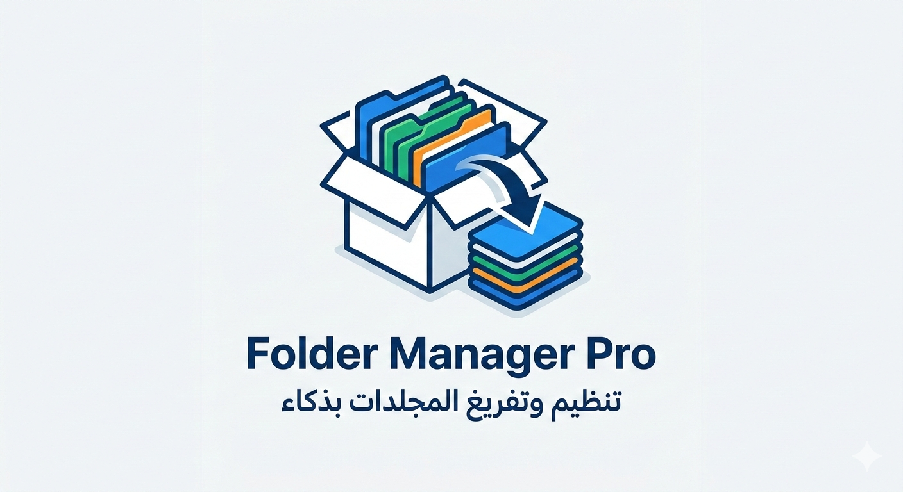

<p align="center">
  
</p>


# 📂 مدير الملفات الاحترافي | Professional File Manager

تطبيق مكتوب بلغة **Python** وباجهة رسومية **PyQt6** متطورة، مصمم لتسهيل إدارة الملفات وتنظيم المجلدات المبعثرة بلمسة زر واحدة. يدعم اللغة العربية بشكل كامل (RTL) ويعمل على كافة أنظمة التشغيل.

## ✨ المميزات الرئيسية

- **تفريغ المجلدات (Flattening):** سحب جميع الملفات من المجلدات الفرعية إلى المجلد الرئيسي وحذف المجلدات الفارغة تلقائياً.
    
- **نقل ملفات محددة:** واجهة مخصصة لاختيار ملفات معينة وعرضها في قائمة بخط عريض (Bold) قبل نقلها لوجهتها الجديدة.
    
- **دعم كامل للغة العربية:** معالجة الحروف العربية لضمان ظهورها بشكل صحيح وغير مقطع.
    
- **عابر للمنصات:** يعمل بكفاءة على **Windows**, **macOS**, و **Linux**.
    
- **ذكاء التسمية:** نظام تلقائي لمنع تكرار الأسماء عند النقل (تجنب استبدال الملفات الأصلية).
    
- **فتح تلقائي:** يفتح مجلد الوجهة فور انتهاء العملية لمراجعة النتائج.
    

* * *

## 🚀 متطلبات التشغيل (Prerequisites)

يجب أن يكون لديك **Python 3.8** أو أحدث مثبتاً على جهازك.

تعتمد الواجهة على المكتبات التالية، يمكنك تثبيتها عبر سطر الأوامر:

Bash

```
pip install PyQt6 arabic-reshaper python-bidi
```

* * *

## 🛠️ تثبيت وتشغيل المشروع

1.  **تحميل المشروع:**
    
    Bash
    
    ```
    git clone https://github.com/your-username/file-manager-pro.git
    cd file-manager-pro
    ```
    
2.  **تشغيل التطبيق:**
    
    Bash
    
    ```
    python main.py
    ```
    

* * *

## 📖 كيفية الاستخدام

### 1\. تبويب تفريغ المجلدات:

- اضغط على زر **"إختيار المجلد والبدء"**.
    
- سيقوم البرنامج بالدخول لكافة المجلدات الفرعية ونقل ما بداخلها للمجلد الذي اخترته.
    
- سيتم حذف جميع المجلدات التي أصبحت فارغة.
    

### 2\. تبويب نقل ملفات محددة:

- اضغط على **"1. اختيار الملفات"** لتحديد مجموعة ملفات من أماكن مختلفة.
    
- ستظهر الأسماء في القائمة البيضاء بخط عريض.
    
- اضغط على **"2. تحديد الوجهة والنقل"** لاختيار المكان الجديد وفتح المجلد فور الانتهاء.
    

* * *

## 🛠️ التقنيات المستخدمة (Tech Stack)

- **Language:** [Python 3](https://www.python.org/)
    
- **GUI Framework:** [PyQt6](https://www.riverbankcomputing.com/software/pyqt/)
    
- **Arabic Support:** `arabic_reshaper`
    
- **OS Operations:** `shutil`, `os`, `subprocess`
    

* * *

## 👨‍💻 المساهمة في المشروع

المساهمات تجعل مجتمع المبرمجين مكاناً رائعاً!

1.  قم بعمل **Fork** للمشروع.
    
2.  أنشئ فرعاً للميزة الجديدة (`git checkout -b feature/AmazingFeature`).
    
3.  قم بعمل **Commit** لتعديلاتك (`git commit -m 'Add some AmazingFeature'`).
    
4.  قم بعمل **Push** للفرع (`git push origin feature/AmazingFeature`).
    
5.  افتح **Pull Request**.
    

* * *

## 📄 الترخيص

هذا المشروع متاح تحت رخصة **MIT**. للمزيد من التفاصيل راجع ملف `LICENSE`.

* * *

**تم التطوير بواسطة: Alaa.ksa** 🚀

